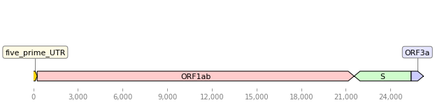
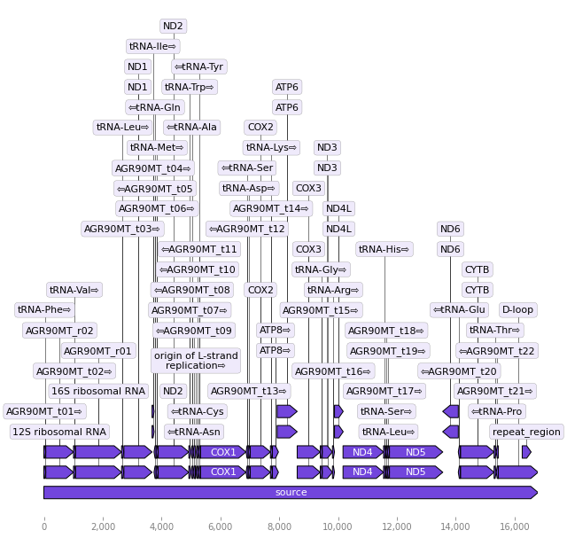
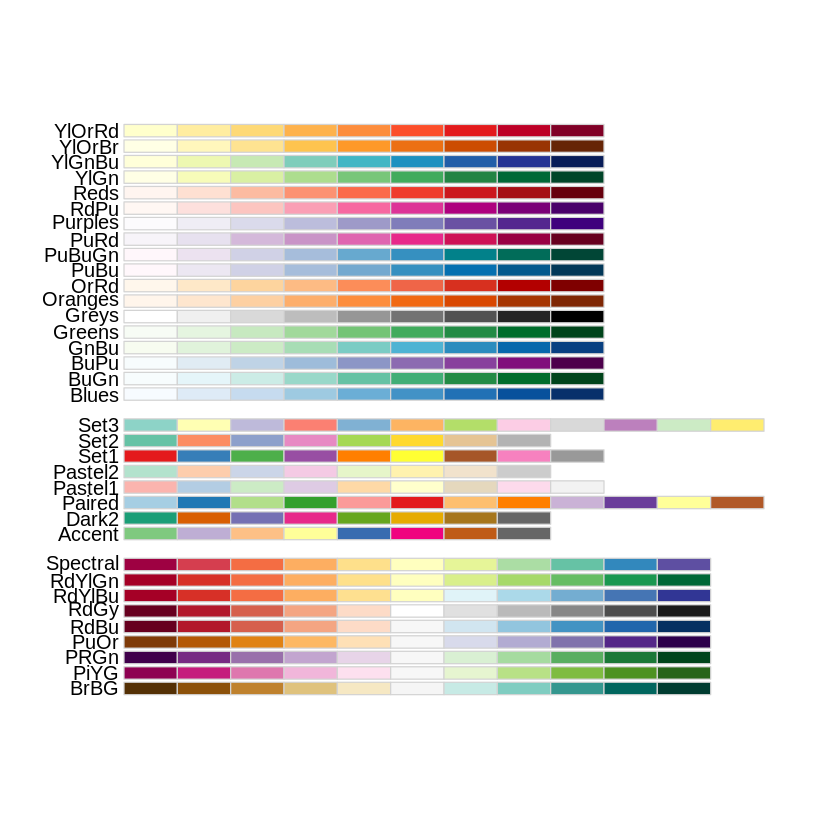
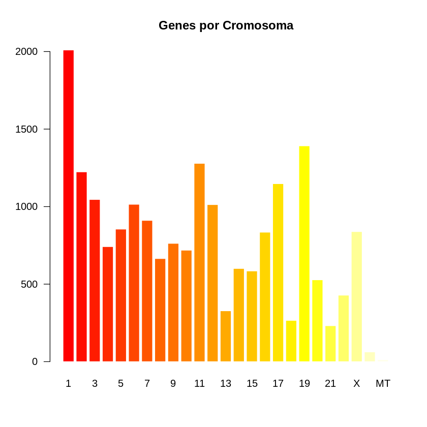
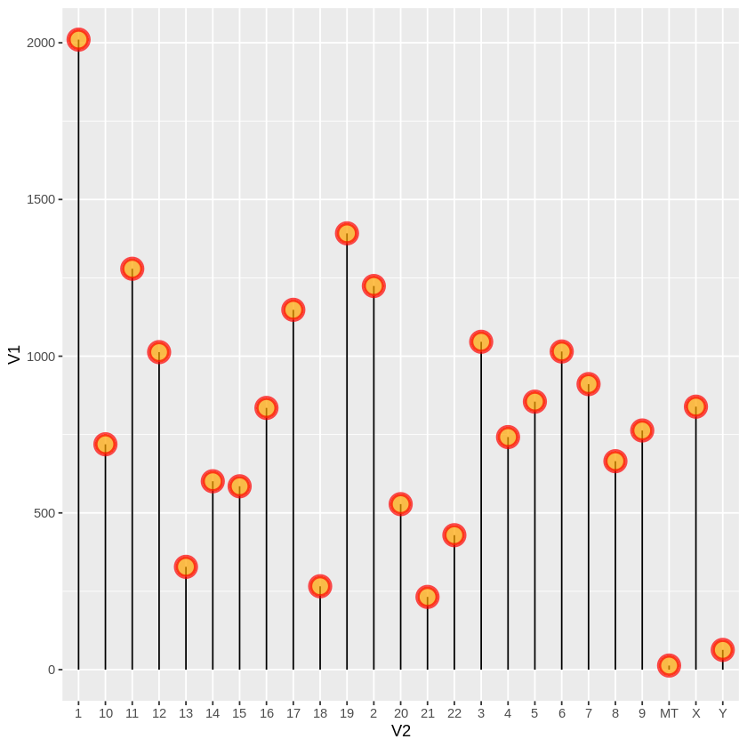

Introducción a Bioinformática
================

Los lenguajes de programación tienen un gran cantidad de aplicaciones para bioinformatica, entre ellos linux representa una ventaja por que la terminal con la que nos comunicamos con linux corre un lenguaje de programación (BASH), al igual que otros lenguajes de programación nos permite la automatización de tareas en la cual se integran diversas herramientas. Como estaremos trabajando en el CLI cualquier comando está a un comando de distancia, bash tiene a su disposición el mismo centro de operaciones.

## CONTENIDO

- [BASH PIPELINES](#bash-pipelines)
- [PYTHON SCRIPTS](#python-scripts)
- [R SCRIPTS](#r-scripts)
- [ENTREZ NCBI PERL](#entrez-ncbi-perl)


## BASH PIPELINES

### COMANDO PRÁCTICOS

### Eliminar espacios en blanco

``` bash
sed '/^$/d' file.txt

grep . file.txt

grep "\S" file.txt
```

### Imprimir lineas entre rangos
``` bash
awk 'NR>=20&&NR<=80' input.txt
```

### Convertir fastq a fasta
``` bash
seqtk seq -a fastq_file.fq > fasta_file.fa
```
### Separar multifasta
``` bash
awk '/^>/{s=++d".fa"} {print > s}' multi.fa
```

### Separar una secuencia especifica de un fasta

``` bash
samtools faidx file.fasta

samtools faidx file.fasta "ID_seq" > ID_seq.fasta
```


## PYTHON SCRIPTS

### Instalando Packages
    
**Instalación de PIP**

``` bash   
sudo apt-get install python3 python3-pip

pip3 install biopython

pip3 install Bio
```

**Instalación conda** [ Miniconda ](https://docs.conda.io/en/latest/miniconda.html#installing) [ Anaconda ](https://www.anaconda.com/products/individual)

``` bash
bash <Mini/A>conda3-latest-Linux-x86_64.sh

conda install -c conda-forge biopython
```

### Importando Packages

``` python 

from Bio import Entrez

Entrez.email = "francisco.ascue@unmsm.edu.pe"

handle = Entrez.efetch(db="Nucleotide", id="AY994334.1",rettype="fasta",retmode="text")

print(handle.read())

``` 

    sudo pip3 install dna_features_viewer

``` python
from dna_features_viewer import GraphicFeature, GraphicRecord

features=[
    GraphicFeature(start=0, end=265, strand=+1, color="#ffd700",
                   label="five_prime_UTR"),
    GraphicFeature(start=266, end=21555, strand=+1, color="#ffcccc",
                   label="ORF1ab"),
    GraphicFeature(start=21563, end=25384, strand=-1, color="#cffccc",
                   label="S"),
    GraphicFeature(start=25393, end=26220, strand=+1, color="#ccccff",
                   label="ORF3a")
]
record = GraphicRecord(sequence_length=26220, features=features)
ax, _ = record.plot(figure_width=10)
``` 


``` python
# import packages
from Bio import Entrez, SeqIO
from dna_features_viewer import annotate_biopython_record
from dna_features_viewer import BiopythonTranslator

# Download sequence in NCBI format

Entrez.email = "francisco.ascue@unmsm.edu.pe"

handle = Entrez.efetch( db="nucleotide", id="NC_000884.1", rettype="gb", retmode="text")

record = SeqIO.read(handle, "genbank")

#record.features = [ f for f in record.features if f.type not in ["gene"] ]

# Save records in to variale

SeqIO.write(record, "seq.gb", "genbank")

# Graphics 

graphic_record = BiopythonTranslator().translate_record("seq.gb")
ax, _ = graphic_record.plot(figure_width=10, strand_in_label_threshold=7)

```



## R SCRIPTS

### Instalando Packages

```r
install.package("BiocManager")
    
##Cargando packages

library(BiocManager)
    
BiocManager::install("ggplot2")

##Actualizando packages

install.packages(c("BiocManager","ggplot2")
    
update.packages(ask = FALSE)

### Cargar tablas (csv, tsv)

read.table("datafile.ext", sep = ",", header = TRUE)
    
read.csv("datafile.csv")
    
### Cargar paletas de colores

library(viridisLite)
library(viridis)
library(RColorBrewer)
display.brewer.all()
``` 


``` r
### barplot basicos

barplot(height = gene$V1, border = FALSE, names.arg = gene$V2, 
        las = 1 ,
        col = heat.colors(25),
        main = "Genes por Cromosoma")
```


``` r
ggplot(gene, aes(x=V2, y=V1)) +
  geom_segment( aes(x=V2, xend=V2, y=0, yend=V1)) +
  geom_point( size=5, color="red", fill=alpha("orange", 0.3), alpha=0.7, shape=21, stroke=2) 

```



## ENTREZ NCBI PERL

``` bash
esearch -db nucleotide -query "covid19"
```
```xml
<ENTREZ_DIRECT>
  <Db>nucleotide</Db>
  <WebEnv>MCID_606a64fe45460140b56b5fe4</WebEnv>
  <QueryKey>1</QueryKey>
  <Count>139219</Count>
  <Step>1</Step>
</ENTREZ_DIRECT>
```
```bash
esearch -db nucleotide -query '("Severe acute respiratory syndrome coronavirus 2"[Organism] AND (viruses[filter])'
```
``` xml
<ENTREZ_DIRECT>
  <Db>nucleotide</Db>
  <WebEnv>MCID_606a6ccaa53f343d4860d16b</WebEnv>
  <QueryKey>1</QueryKey>
  <Count>130415</Count>
  <Step>1</Step>
</ENTREZ_DIRECT>
```

```bash
esearch -db nucleotide -query '("Severe acute respiratory syndrome coronavirus 2"[Organism] AND (viruses[filter])' -mindate 2021/01/01 -maxdate 2021/01/02
```

```xml
<ENTREZ_DIRECT>
  <Db>nucleotide</Db>
  <WebEnv>MCID_606a6f2559c60d0d1e6a4984</WebEnv>
  <QueryKey>1</QueryKey>
  <Count>59</Count>
  <Step>1</Step>
</ENTREZ_DIRECT>
```
```bash
esearch -db nucleotide -query '("Severe acute respiratory syndrome coronavirus 2"[Organism] AND (viruses[filter])' -mindate 2020/01/01 -maxdate 2021/03/02 | efilter -country peru
```
```xml
<ENTREZ_DIRECT>
  <Db>nucleotide</Db>
  <WebEnv>MCID_606a6fb2fdbe9156e53f0caa</WebEnv>
  <QueryKey>2</QueryKey>
  <Count>90</Count>
  <Step>2</Step>
</ENTREZ_DIRECT>
```
```bash
esearch -db nucleotide -query '("Severe acute respiratory syndrome coronavirus 2"[Organism] AND (viruses[filter])' -mindate 2021/01/01 -maxdate 2021/03/02 | efilter -country peru | efetch -format fasta
```
```fasta
>MW494424.1 Severe acute respiratory syndrome coronavirus 2 isolate SARS-CoV-2/human/PER/LIM-INS-173/2020, complete genome
CTCGTCTATCTTCTGCAGGCTGCTTACGGTTTCGTCCGTGTTGCAGCCGATCATCAGCACATCTAGGTTT
TGTCCGGGTGTGACCGAAAGGTAAGATGGAGAGCCTTGTCCCTGGTTTCAACGAGAAAACACACGTCCAA
CTCAGTTTGCCTGTTTTACAGGTTCGCGACGTGCTCGTACGTGGCTTTGGAGACTCCGTGGAGGAGGTCT
TATCAGAGGCACGTCAACATCTTAAAGATGGCACTTGTGGCTTAGTAGAAGTTGAAAAAGGCGTTTTGCC
TCAACTTGAACAGCCCTATGTGTTCATCAAACGTTCGGATGCTCGAACTGCACCTCATGGTCATGTTATG
GTTGAGCTGGTAGCAGAACTCGAAGGCATTCAGTACGGTCGTAG ...
```
```bash
esearch -db pubmed -query "Severe acute respiratory syndrome coronavirus2" | elink -related | efetch -format docsum |   xtract -pattern Author -element Name |   sort-uniq-count-rank
```
```table
37      Li Y
26      Wang Y
25      Li J
24      Zhang J
24      Zhang Y
20      Wang J
20      Zhang S
19      Zhang L
18      Wang X
18      Zhang X
.       .
.       .
.       .
```

[Menu Curso](README.md) [>>Siguiente Pagina](4-6Linux.md)
