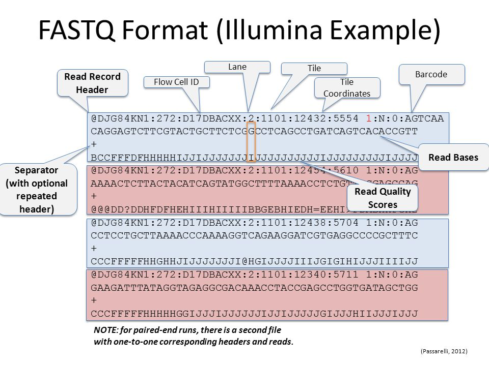
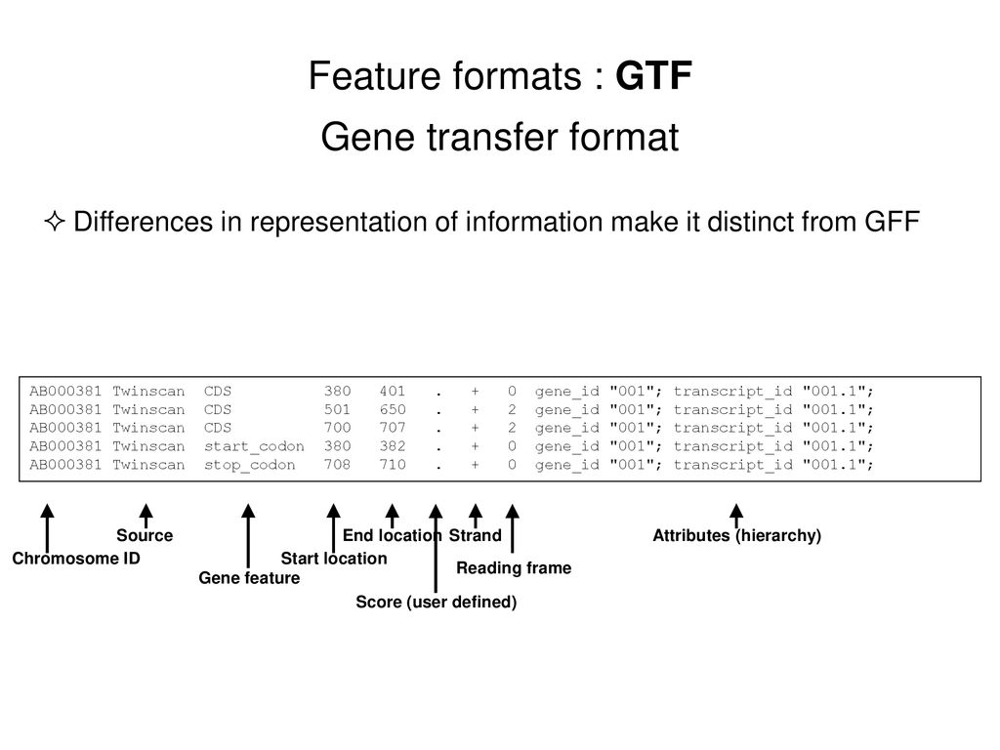
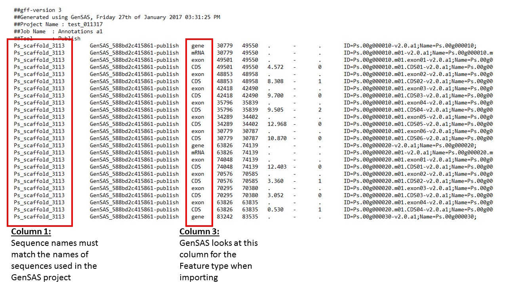
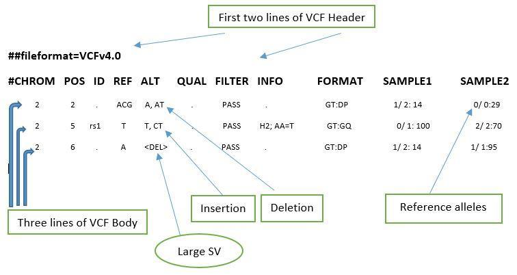

<p align="center">
    
</p>

BASH SCRIPT PARA DATOS NGS
==================

## CONTENIDO

- [BASH PIPELINES](#bash-pipelines)
- [BASH SCRIPTS](#bash-scripts)
- [SYNTAXIS](#syntaxis)
- [ARCHIVOS PARA DATOS NGS](#archivos-para-datos-ngs)

Pipelines y Scripts para Bioinformática
=======================================

## BASH PIPELINES

<p align="center" width="100%">
     
     
</p>

### Conteo de secuencias en FastQ
``` bash
fgrep -i "@S" file.fq | wc -l

cat file.fq | echo $((`wc -l`/4))
```
### Nombre de los genes anotados 
``` bash
grep $'\tgene\t' sequence.gff3 | perl -ne '/ID=([^;]+)/ and printf("%s\n", $1)'

grep $'\tgene\t' sequence.gff3 | awk '{print $9}' | cut -d';' -f1 | sed "s/ID=//g"
```
### Mesclando scripts:

``` bash
grep $'\tgene\t' sequence.gff3 | awk '{print $5-$4";"$9}'| sed 's/Name=//g' | awk -F';' '{print $3"\t"$1}' | sort -k2n  > Tamaño_genes.txt

awk '{print $3}' sequence.gff3 | sort -d | uniq -c
```

## BASH SCRIPTS

***she bang***

```bash
#!interpreter [optional-arg]

#!/bin/sh
#!/bin/bash
#!/usr/bin/python3
#!/usr/bin/awk -f
```

```bash
#!/bin/bash

##CONSTANTES

VAR1="UAG"
VAR2="UAA"

##EJECUCION
## && (y) || (o)

for i in {A,U,G,C}{A,U,G,C}{A,U,G,C}
do
        if [ "$i" != "UGA" ] || [ "$i" != "$VAR2" ]; then
                echo "$i phe"
        fi
done

```
### Permisos

``` bash 

# cambia permisos a archivos y carpetas

# d rwx rwx rwx / (propietario) (grupos) (demas)
# r 4
# w 2		
# x 1 

chmod 775 ACGT.bash

chmod +rwx ACGT.bash

# R recursivo 

chmod -R 755 

``` 

### Correr un script

```bash
<lenguaje> script.ext

### Sin permisos

bash ACGT.bash

### Con permisos

./ACGT.bash 

### Segundo plano

./ACGT.bash&

```

### Correr en segundo plano o screen

```bash

# Añadir el caracter &
bash scrip.bash&

### Activando un screen

screen -S name

./ACGT.bash

## salir del screen CTRL A + D

## ingresar al screen nuevamente

scren -ls 

screen -r name  
```

### Detener procesos

```bash

# muestrar los procesos actuales

ps 
pstree
top -u user

#detener procesos por comando
kill PID

top -u user 
# presiona "k" y indica el PID 

htop 
# buscar el proceso y presionar "k" 
```

## SYNTAXIS

```bash
#!/bin/bash

###COMENTARIOS

###VARIABLES

VAR1=""
VAR2=""
VAR3=""

###EXECUTION

echo "started at ´date´"
echo "mkdir -p ${OD}"

mkdir -p ${IDX}

echo "bowtie2-build -threads 30 ${REF} ${IDX}/cavpor3"
bowtie2-build -threads 30 ${REF} ${IDX}/cavpor3

echo "Finished at ´date´"
```

Introducción a datos NGS
=========================


## ARCHIVOS PARA DATOS NGS

### Formatos 

<p align="center" width="100%">
     
     
</p>

<p align="center" width="100%">
     
     
    
</p>
