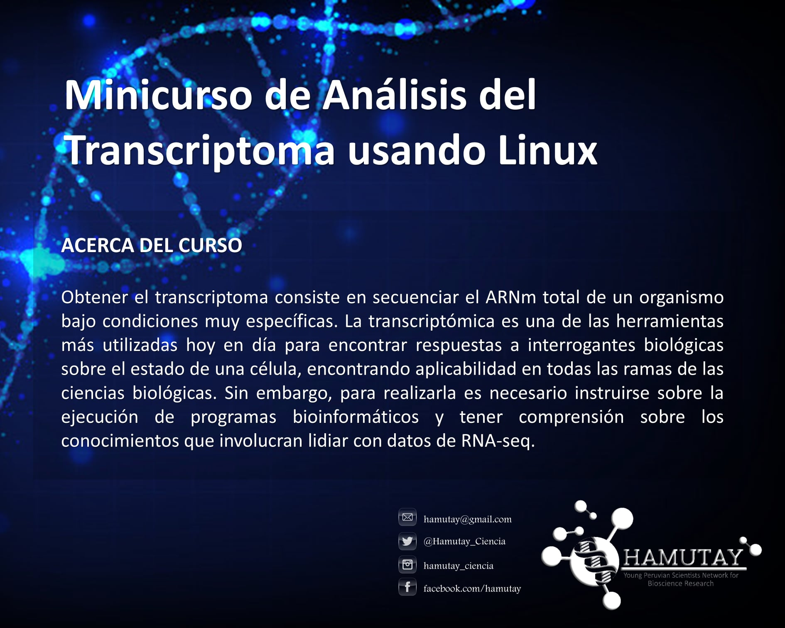
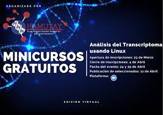

Minicurso de Análisis del Transcriptoma Usando Linux 
=========

## Descargar repositorio

`git clone https://github.com/FranciscoAscue/Curso_transcriptomica.git`   

### Instalar programas

`bash preinstall.sh`

## Objetivo

Adiestrar al participante en métodos del análisis transcriptómico (por referencia), incluyendo el mapeo, recuento de secuencias, normalización y análisis de expresión diferencial.

## Numero de participantes

12 Personas

## Requisitos

- Estudiantes de tercer año en adelante o posgrado.
- Deseable que participen en un proyecto con la temática y tengan sus propios datos.
- PC con sistema operativo Linux (Ubuntu u otro con arquitectura debían) o Windows 10 (<a href="https://docs.microsoft.com/en-us/windows/wsl/install-win10">configurar Windows subsystem for Linux</a>). 
- Memoria interna libre: 50 Gb, RAM: min. 4 Gb. Procesador: Core i5 o equivalente.
- Manejo de línea comandos en Linux y conocimientos en R.
- Instalar la lista de programas a ser utilizados.

## Cronograma de actividades

**Linux para Bionformatica**

| Horario  |  Presentador  |  Actividad | Programas a utilizar |
|:----------:|:-------------:|:-----------:|:---------------------:|
|1:30 pm-2:00 pm |Francisco Ascue|Introducción|-|
|2 pm - 2:30 pm |Francisco Ascue| Entorno Linux (¿ Por qué usar Linux ?), Comandos prácticos|bash, awk    [ver manual](1-3Linux.md)|
|2:30 pm - 3:30 pm|Francisco Ascue|Programas y lenguajes para Bioinformática|biopython, bioconductor, bioperl.   [ver manual](1-3Linux.md)|
|3:30 pm - 4:00 pm|-|Receso|-|
|4:00 pm - 5:00 pm|Francisco Ascue|Pipelines y Scripts para Bioinformática|bash script   [ver manual](4-6Linux.md)|
|5:00 pm - 6:00 pm|Francisco Ascue|Archivos y formatos para datos de NGS|[FastQ](Images/FastQ.jpg),[SAM](Images/SAM.jpg), [GFF3](Images/gff3.jpg), [GTF](Images/gtf.jpg), [VCF](Images/vcf.png)|
|6:00 pm - 7:30 pm|Francisco Ascue|Procesamiento de datos de NGS|fastqc, trimmomatic, bowtie2, spades   [ver manual](NGSLinux.md)|

**Introducción a Transcriptomica**

| Horario  |  Presentador  |  Actividad | Programas a utilizar |
|:----------:|:-------------:|:-----------:|:---------------------:|
|09:00 am-9:30 am |Carlo Gustavo Mormontoy|Presentación e introducción al curso.|-|
|9:30 am - 10:00 am |-|Revisión de programas y soporte de instalación|-|
|10:00 am - 12:00 pm|Francisco Ascue|Bloque I: Análisis de secuencias: mapeo, recuento y ensamblaje.|STAR, featureCounts, SortMeRNA, Samtools    [ver manual](transcriptomic.md)|
|12:00 pm - 1:30 pm|-|Almuerzo|-|
|1:30 pm - 3:30 pm|Carlo Gustavo Mormontoy|Bloque II: Normalización y expresión diferencial.|DEseq2, Vennt, EnhancedVolcano|
|3:30 pm - 4:30 pm|Carlo Gustavo Mormontoy|Bloque III: Anotación funcional y enriquecimiento.|Blast2GO, Cytoscape (BiNGO)|
|4:30 pm - 6:00 pm|Francisco Ascue|Bloque IV: Expresión diferencial y miscellaneous.|ggplot, pheatmap, KEGG.db, GO,db|

## Sofwares y pacquetes

Samtools: https://github.com/samtools/samtools    
Stringtie: https://github.com/gpertea/stringtie    
featureCounts: https://pubmed.ncbi.nlm.nih.gov/24227677/    
SortMeRNA: https://bioinfo.lifl.fr/RNA/sortmerna/     
STAR: https://github.com/alexdobin/STAR     
DEseq2: https://bioconductor.org/packages/release/bioc/html/DESeq2.html     
Vennt: https://github.com/drpowell/vennt     
EnhancedVolcano: https://github.com/kevinblighe/EnhancedVolcano     
Blast2GO: https://www.blast2go.com/ (Free Trial)    
Cytoscape: https://cytoscape.org/     
BiNGO: https://www.psb.ugent.be/cbd/papers/BiNGO/Home.html   

