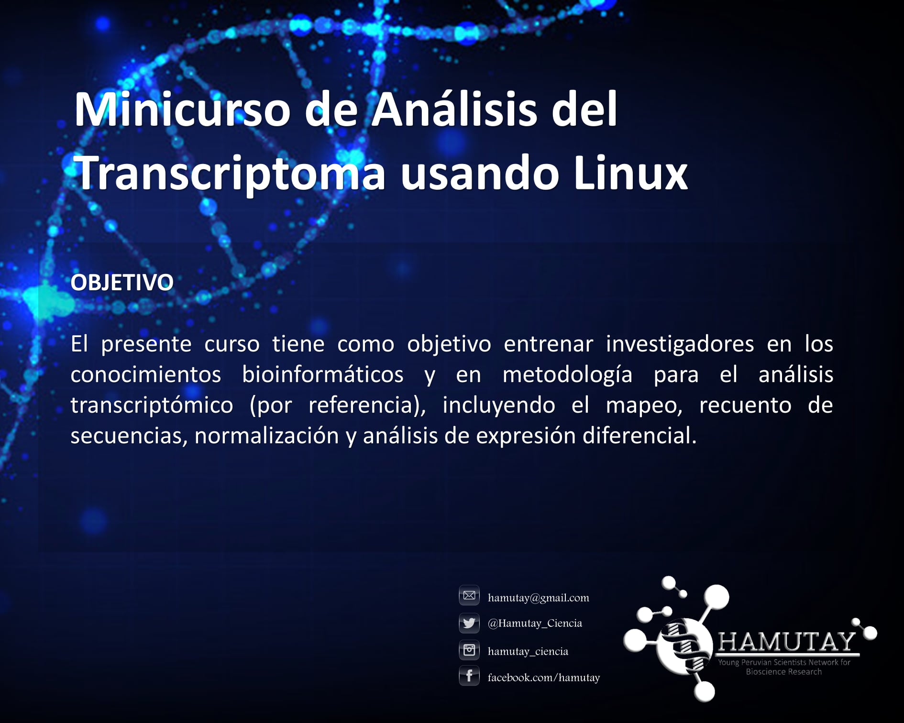
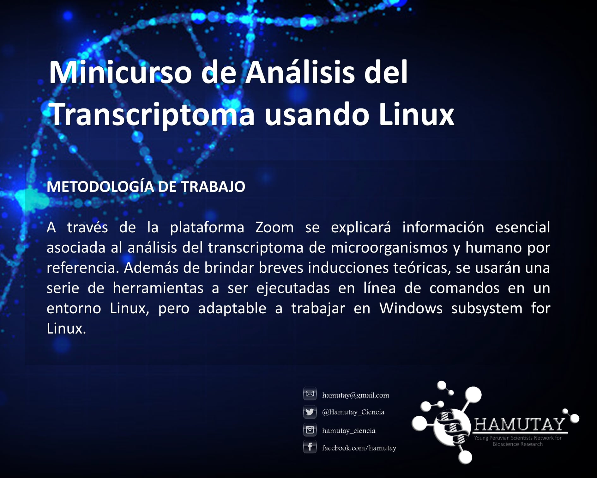
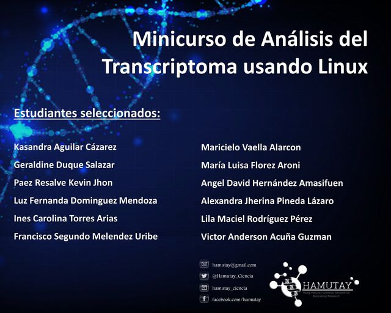

[HOME](README.md) - [MATERIALES](materiales.md) - [INFORMACION](README.md#organizador)

Análisis del Transcriptoma Usando Linux 
=========

Este repositorio contiene los scripts y archivos que se utilizarán durante el curso. 

# Detalles del evento

|                          |                     |
|--------------------------|---------------------|
|Apertura de inscripciones | 15 de marzo del 2021|
|Fecha del evento	| 24 y 25 de abril del 2021|
|Cierre de inscripciones | 4 de abril del 2021|
|Fecha de publicación de seleccionados | 11 de abril del 2021|
|Lugar del evento| Virtual mediante la plataforma zoom|

|                                               |                                               |
|-----------------------------------------------|-----------------------------------------------|
|  |  |
|  |  |

## Numero de participantes

12 Personas

## Requisitos

- Estudiantes de tercer año en adelante o posgrado.
- PC con sistema operativo Linux (Ubuntu u otro con arquitectura debían) o Windows 10 (<a href="https://docs.microsoft.com/en-us/windows/wsl/install-win10">configurar Windows subsystem for Linux</a>). 
- Memoria interna libre: 50 Gb, RAM: min. 4 Gb. Procesador: Core i5 o equivalente.
- Manejo de línea comandos en Linux y conocimientos en R.

## Cronograma de actividades

**Linux para Bionformatica**

| Horario  |  Presentador  |  Actividad | Programas a utilizar |
|:----------:|:-------------:|:-----------:|:---------------------:|
|1:30 pm-2:00 pm |Francisco Ascue|Introducción|-|
|2 pm - 2:30 pm |Francisco Ascue| Entorno Linux (¿ Por qué usar Linux ?), Comandos prácticos|bash, awk    [ver manual](1-3Linux.md)|
|2:30 pm - 3:30 pm|Francisco Ascue|Programas y lenguajes para Bioinformática|biopython, bioconductor, bioperl.   [ver manual](1-3Linux.md)|
|3:30 pm - 4:00 pm|-|Receso|-|
|4:00 pm - 5:00 pm|Francisco Ascue|Pipelines y Scripts para Bioinformática|bash script   [ver manual](4-6Linux.md)|
|5:00 pm - 6:00 pm|Francisco Ascue|Archivos y formatos para datos de NGS|[FastQ](Images/FastQ.jpg),[SAM](Images/SAM.jpg), [GFF3](Images/gff3.jpg), [GTF](Images/gtf.jpg), [VCF](Images/vcf.png)   [ver manual](NGSLinux.md)|
|6:00 pm - 7:30 pm|Francisco Ascue|Procesamiento de datos de NGS|fastqc, trimmomatic, bowtie2, spades   [ver manual](NGSLinux.md)|

**RNA-seq para el Análisis transcriptomico**

| Horario  |  Presentador  |  Actividad | Programas a utilizar |
|:----------:|:-------------:|:-----------:|:---------------------:|
|09:00 am-9:30 am |Carlo Gustavo Mormontoy|Introducción al Transcriptomica.|-|
|9:30 am - 10:00 am |-|Revisión de programas y soporte de instalación|-|
|10:00 am - 12:00 pm|Francisco Ascue|Bloque I: Análisis de secuencias: mapeo, recuento y ensamblaje.|STAR, featureCounts, SortMeRNA, Samtools    [ver manual](transcriptomic.md)|
|12:00 pm - 1:30 pm|-|Almuerzo|-|
|1:30 pm - 3:30 pm|Carlo Gustavo Mormontoy|Bloque II: Normalización y expresión diferencial.|DEseq2, Vennt, EnhancedVolcano|
|3:30 pm - 4:30 pm|Carlo Gustavo Mormontoy|Bloque III: Anotación funcional y enriquecimiento.|Blast2GO, Cytoscape (BiNGO)|
|4:30 pm - 6:00 pm|Francisco Ascue|Bloque IV: Expresión diferencial y miscellaneous.|ggplot, pheatmap, KEGG.db, GO,db|

## CERTIFICACIONES

Para los interesados en obtener el certificado de participación se requerirá su asistencia obligatoria durante todo el minicurso y la calificación mínima de 14/20 en el examen de conclusión del minicurso. Además, los postulantes deben participar activamente durante el minicurso respondiendo las preguntas y expresar sus dudas libremente (usando el chat o audio del zoom, y compartiendo pantalla si es necesario para ayudarle eficientemente durante el minicurso).

## ORGANIZADOR

Hamutay - Young Peruvian Scientists Network for Bioscience Research.

### Apoyo Institucional

Sociedad Peruana de Biología
ISCB RSG of Peru

### Auspiciador
Milrd

