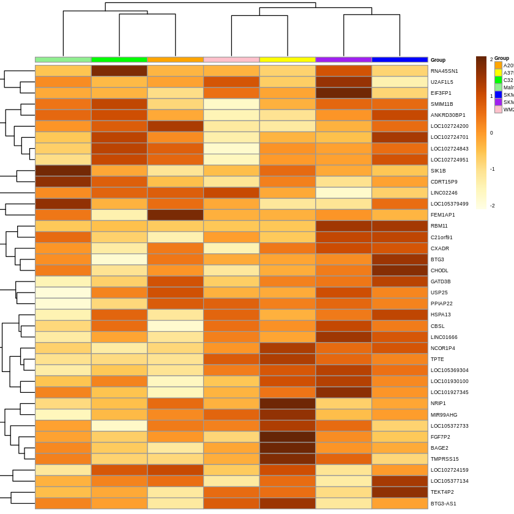

[Página anterior<<](NGSLinux.md)  [Menu Curso](README.md#cronograma-de-actividades)

Analisis de datos RNA-Seq
================

## Introducción


### Instalacion de programas


``` bash
git clone https://github.com/FranciscoAscue/Curso_transcriptomica.git

#Ubuntu20
bash preinstall.sh

#Ubuntu18

bash preinstall.sh
```
### Directorio de trabajo

``` bash
── RNA_Seq/
  │   └── genome/                    <- genoma de referencia (.FASTA) , anotación de genoma (.GTF/.GFF)
  │  
  │   └── reads/                     <- RNAseq data
  │  
  │   └── results/                   <- Archivos generados
  │       ├── quality/               <- Archivos de calidad
  │           ├──multiQC/            <- calidad conjunta
  │           ├──rawdata/            <- calidad de data cruda
  │       ├── trimmed/               <- Archivos filtrados
  │       ├── sortmerna/             <- Archivos filtrados de rRNA
  │           ├── aligned/           <- Secuencias alineadas a rRNA databases (con contenido de rRNA)
  │           ├── filtered/          <- Secuencias con rRNA removidos  (libre de rRNA)
  │           ├── logs/              <- logs
  │       ├── map/                   <- Alineamientos al genoma de referencia
  │           ├── aligned_bam/       <- Archivos de alineamiento (.BAM)
  │           ├── aligned_logs/      <- logs
  │       ├── counts/                <- Conteo de secuencias finales
  │  
  │   └── sortmerna_db/              <- rRNA databases
  │       ├── rRNA_databases/        <- rRNA (bacteria, archea y eukaryotes)
  │  
  │   └── scripts/                   <- Scripts usados con el curso
```

## REPOSITORIO DE DATOS DE TRANSCRIPTOMA

Los datos utilizados en este curso fueron descargados de [EMBL-EBI](https://www.ebi.ac.uk/), usando la base de datos de [Expression Atlas](https://www.ebi.ac.uk/gxa/home). Para mas detalles del los datos utilizados en este curso puede revisar el siguiente [Link](https://www.omicsdi.org/dataset/atlas-experiments/E-GEOD-46817) o puede visualizar directamente a partir de la base de datos **Expression Atlas** [E-GEOD-46817](https://www.ebi.ac.uk/gxa/experiments/E-GEOD-46817/Results) 


## CONTENIDO

- [DESCARGAR SECUENCIAS](#descargar-secuencias)
- [CONTROL DE CALIDAD](#control-de-calidad)
- [FILTRADO DE SECUENCIAS](#filtrado-de-secuencias)
- [FILTRADO DE rRNA](#filtrado-de-rrna)
- [ALINEAMIENTO](#alineamiento)
- [CONTEO DE SECUENCIAS](#conteo-de-secuencias)
- [IMPORTAR A R](#importar-a-r)

## DESCARGAR SECUENCIAS

### Descargar desde SRA-db

```bash

### Sra-tool kit

prefetch -O ~/Minicurso_transcriptomica/RNA_seq/reads SRR8495--

# prefetch.2 -a 'ascp|/PATH_to_aspera/.aspera/connect/etc/asperaweb_id_dsa.openssh' -X 100G -O SRR8495-- SRX8495--

fasterq-dump SRR8495--.sra -S -m 1G -O ~/Minicurso_transcriptomica/RNA_seq/reads -e 2

```

### Para descargar datos utilizados en el curso

```bash
wget --load-cookies /tmp/cookies.txt "https://docs.google.com/uc?export=download&confirm=$(wget --quiet --save-cookies /tmp/cookies.txt --keep-session-cookies --no-check-certificate 'https://docs.google.com/uc?export=download&id=FILEID' -O- | sed -rn 's/.*confirm=([0-9A-Za-z_]+).*/\1\n/p')&id=FILEID" -O FILENAME && rm -rf /tmp/cookies.txt
```


|SAMPLE| FILEID | FILENAME |   
|:----------:|:-------------:|:-----------:|
|SRR849504| `1p6jTh3JYK3mCmusOj3dj_fRLc2G4v5-s` |	NC_000021.9_1.fq |
|| `1R9R9d9vETQNuOwKOqXUQfkIufmrBXWef` |  NC_000021.9_2.fq |
|SRR849505| `1dGt-SSyze4yuNqtN9MPXGIeBj42I3YFf` |	 NC_000021.9_1.fq |
|| `18eSbO-rEWt9iv22vlPlb8YaisudC8UIq` |  NC_000021.9_2.fq |
|SRR849506|	`1FGk-0jAOMk2msL6buFAnMhYgpXve4Z8t` |  NC_000021.9_1.fq |
|| `18vp7LD-makAdcrpyaoqNOp6D1J6dvtEr` |  NC_000021.9_2.fq |
|SRR849507|	`1WceQz3qDvlFAhBQMt4YJPSCguUYNcaJr` |  NC_000021.9_1.fq |
|| `1CGjXGrTS6iIJ2e_Y2bcvfBI60FenlAB7` |  NC_000021.9_2.fq |
|SRR849508|	`1HZBUwCGjuYFjyHkavdzkh6rQ1W3EFA9l` |  NC_000021.9_1.fq |
|| `1pTT17NMb2UYs1ZRS96a2z8nXyDEz2_tR` |  NC_000021.9_2.fq |
|SRR849509| `1_1s_6A-sRxhcWgIUTMU3PiCgp6gbEC17`	|  NC_000021.9_1.fq |
|| `1ZetrrsOnbHlGLD43RwwJjBSBVP35ABy-` |  NC_000021.9_2.fq |
|SRR849510|	`1XC8kvuDazTsf5_GDLGoE-c4WrRfZyagw` |  NC_000021.9_1.fq |
|| `1Hb9PfckXKXT_pegNF_AOA3SVa4oh6zRA` |  NC_000021.9_2.fq |


## CONTROL DE CALIDAD

```bash

# fastqc

fastqc -t 2 NC_000021.9_1.fq NC_000021.9_2.fq -o ~/Minicurso_transcriptomica/results/quality/multiQC/

#### Output

── results/multiQC/
    └── NC_000021.9_1.html     <- Estadisticas de calidad NC_000021.9_1.fq
    └── NC_000021.9_2.html     <- Estadisticas de calidad NC_000021.9_2.fq
    └── NC_000021.9_1.zip      <- Datos obtenidos por Fastqc
    └── NC_000021.9_2.zip      <- Datos obtenidos por Fastqc 

# multiqc

cd ~/Minicurso_transcriptomica/results/quality/multiQC/

multiqc .

#### Output

── results/multiQC/
    └── multiqc_report.html     <-  Estadisticas de calidad de todos los archivos fastqc (.html) 
    └── multiqc_data/           <-  Datos que multiqc encontró de varios archivos de registro (.zip)
```
    
## FILTRADO DE SECUENCIAS

```bash 

#trim_galore 
    trim_galore --quality 20 --fastqc --length 25 --output_dir results/trimmed/ reads/SRR849504/NC_000021.9_1_trimmed.fastq
    
```

## FILTRADO DE rRNA

```bash
## sortmerna

    # Guardar en una variable los rRNA databases
    sortmernaREF=sortmerna_db/rRNA_databases/silva-arc-16s-id95.fasta,sortmerna_db/index/silva-arc-16s-id95:\
    sortmerna_db/rRNA_databases/silva-arc-23s-id98.fasta,sortmerna_db/index/silva-arc-23s-id98:\
    sortmerna_db/rRNA_databases/silva-bac-16s-id90.fasta,sortmerna_db/index/silva-bac-16s-id95:\
    sortmerna_db/rRNA_databases/silva-bac-23s-id98.fasta,sortmerna_db/index/silva-bac-23s-id98:\
    sortmerna_db/rRNA_databases/silva-euk-18s-id95.fasta,sortmerna_db/index/silva-euk-18s-id95:\
    sortmerna_db/rRNA_databases/silva-euk-28s-id98.fasta,sortmerna_db/index/silva-euk-28s-id98

    # Run SortMeRNA (~4min)
    
    sortmerna --ref $sortmernaREF --reads results/trimmed/NC_000021.9_1_trimmed.fq \  
    --aligned results/sortmerna/aligned/sample_aligned.fq \
    --other results/sortmerna/filtered/sample_filtered.fq \
    --fastx \
    --log \
    -a 4 \
    -v

    # mover los log a resultados
    mv -v results/

```

## ALINEAMIENTO

### Es puede tomar con los datos completos alrededor de 30 minutos
### Para el curso utilizaremos unicamente el cromosoma 21 [NC_000021.9](https://www.ncbi.nlm.nih.gov/nuccore/NC_000021.9)    

Antes de empezar con el alineamiento se va desargar el archivo de anotación gff3 del cromosoma 21 y se utilizará el programa **gffread** para convertir al formato gtf, para mas detalles revisar el repositorio del programa [aqui](https://github.com/gpertea/gffread)

```bash

  cd /some/build/dir
  git clone https://github.com/gpertea/gffread
  git clone https://github.com/gpertea/gclib.git
  cd gffread
  make release
  
```

#### Indexar el genoma con gtf-file
#### Descargamos primero el archivo gff3 del NCBI

```bash
wget -O NC_000021.9.gff3 "https://www.ncbi.nlm.nih.gov/sviewer/viewer.cgi?db=nuccore&report=gff3&id=NC_000021.9,NC_000021.9"

```
#### Convertimos el archivo gff3 a gtf
```bash

gffread -E -O -T NC_000021.9.gff -o NC_000021.9.gtf

```

    STAR \
    --runMode genomeGenerate \
    --genomeDir genome/star_index \
    --genomeFastaFiles genome/NC_000021.9.fna \
    --sjdbGTFfile annotation/NC_000021.9.gtf \
    --runThreadN 2

#### Command

    # Help
    STAR -h

    # Run STAR (~3min)
    STAR \
    --genomeDir genome/star_index \
    --readFilesIn results/trimmed/sample_filtered.fq  \
    --runThreadN 2 \
    --outSAMtype BAM SortedByCoordinate \
    --quantMode GeneCounts

    # Move the BAM file into the correct folder
    mv -v results/4_aligned_sequences/sampleAligned.sortedByCoord.out.bam results/4_aligned_sequences/aligned_bam/

    # Move the logs into the correct folder
    mv -v results/4_aligned_sequences/${BN}Log.final.out results/4_aligned_sequences/aligned_logs/
    mv -v results/4_aligned_sequences/sample*Log.out results/4_aligned_sequences/aligned_logs/

#### Output

``` bash
── results/map/
    └── aligned_bam/sampleAligned.sortedByCoord.out.bam   <- Sorted BAM alignment fole
    └── aligned_logs/sampleLog.final.out                  <- Log of STAR alignment rate
    └── aligned_logs/sampleLog.out                        <- Log of steps take during STAR alignment
```

## CONTEO DE SECUENCIAS

    featureCounts -h
    
```bash
# guardar los archivos en una variable
    dirlist=$(ls -t ./*.bam | tr '\n' ' ')
    
    echo $dirlist

# Correr featureCounts de todas las muestras (~4 minutes)
    
    featureCounts \
    -a ../../annotation/* \
    -o ../../results/5_final_counts/final_counts.txt \
    -g 'gene_name' \
    -T 4 \
    $dirlist

```
#### Output

``` bash
── results/counts/
    └── final_counts.txt                <- Final gene counts across all samples
    └── final_counts.txt.summary        <- Summary of gene summarization 

```bash
# Se puede utilzar el program HTSEQ para el mismo proposito

    htseq-count -s no -r pos -t exon -f bam  <BAMFILE> <GTF> > <SALIDA>
    
```


## IMPORTAR A R

``` r
library(DESeq2)
library(ggplot2)
library(clusterProfiler)
library(biomaRt)
library(ReactomePA)
library(DOSE)
library(KEGG.db)
library(org.Hs.eg.db)
library(pheatmap)
library(genefilter)
library(RColorBrewer)
library(GO.db)
library(topGO)
library(dplyr)
library(gage)
library(ggsci)
```


``` r
data <- read.table("final_counts.txt", header = TRUE, skip = 1, row.names = 1)
#head(data)
data <- data[,c(-1:-5)]
colnames(data) <- gsub("_21.bam", "", colnames(data), fixed = T)
colnames(data) <- gsub("_21.bam", "", colnames(data), fixed = T)
colnames(data) <- gsub("..", "", colnames(data), fixed = T)
#data

metadata <- read.delim("muestras.txt", row.names = 1)
metadata$sampleid <- row.names(metadata)
metadata <- metadata[match(colnames(data), metadata$sampleid),]
#head(metadata)


#condition <- factor(c("A2058","A375","C32","Malme3M","SKMEL28", "SKMEL5","WM2664"))
#design <- as.formula(~Group)

#modelMatrix <- model.matrix(design, data = metadata)
#modelMatrix

ddsMat <- DESeqDataSetFromMatrix(countData = data, colData = metadata , design = ~1)
ddsMat <- DESeq(ddsMat)
```

`Warning message in DESeq(ddsMat):`   
`“the design is ~ 1 (just an intercept). is this intended?`   
`estimating size factor`   
`estimating dispersion`   
`gene-wise dispersion estimate`   
`mean-dispersion relationshi`   
`final dispersion estimate`   
`fitting model and testin`   
`-- replacing outliers and refitting for 18 gene`   
`-- DESeq argument 'minReplicatesForReplace' = 7`     
`-- original counts are preserved in counts(dds`  
`estimating dispersion`   
`fitting model and testi` 

```r
results <- results(ddsMat, pAdjustMethod = "fdr", alpha = 0.05)
summary(results)
```
    out of 432 with nonzero total read count
    adjusted p-value < 0.05
    LFC > 0 (up)       : 225, 52%
    LFC < 0 (down)     : 0, 0%
    outliers [1]       : 0, 0%
    low counts [2]     : 10, 2.3%
    (mean count < 0)
    [1] see 'cooksCutoff' argument of ?results
    [2] see 'independentFiltering' argument of ?results

```r
mcols(results, user.names = True)
```

    DataFrame with 6 rows and 2 columns
                           type            description
                    <character>            <character>
    baseMean       intermediate mean of normalized c..
    log2FoldChange      results log2 fold change (ML..
    lfcSE               results standard error: Inte..
    stat                results Wald statistic: Inte..
    pvalue              results Wald test p-value: I..
    padj                results  fdr adjusted p-values
   
```r
results$description <- mapIds( x = org.Hs.eg.db, keys = row.names(results), column = "GENENAME", keytype = "SYMBOL", multiVals = "first")
results$symbol <- row.names(results)
results$entrez <- mapIds(x = org.Hs.eg.db, keys= row.names(results), column = "ENTREZID", keytype = "SYMBOL", multiVals = "first")
results$ensembl <- mapIds(x = org.Hs.eg.db, keys = row.names(results), column = "ENSEMBL", keytype = "SYMBOL", multiVals = "first")
```
```r
results_sig <- subset(results, padj < 0.05)
head(results_sig)
```

    log2 fold change (MLE): Intercept 
    Wald test p-value: Intercept 
    DataFrame with 6 rows and 10 columns
                  baseMean log2FoldChange     lfcSE      stat      pvalue
                 <numeric>      <numeric> <numeric> <numeric>   <numeric>
    GATD3B        36.51642        5.19047  0.272218  19.06737 4.71426e-81
    LOC102724159  50.25903        5.65131  0.327048  17.27974 6.68489e-67
    LOC102724200   8.13856        3.02477  0.480640   6.29322 3.10953e-10
    SIK1B         19.51849        4.28677  0.362775  11.81662 3.20333e-32
    LOC102724701  36.76702        5.20034  0.338991  15.34063 4.09180e-53
    CBSL          16.40618        4.03617  0.617085   6.54070 6.12330e-11
                        padj            description       symbol      entrez
                   <numeric>            <character>  <character> <character>
    GATD3B       1.96972e-80 glutamine amidotrans..       GATD3B   102724023
    LOC102724159 2.66134e-66 periodic tryptophan .. LOC102724159   102724159
    LOC102724200 8.00135e-10 trafficking protein .. LOC102724200   102724200
    SIK1B        1.11719e-31 salt inducible kinas..        SIK1B   102724428
    LOC102724701 1.54173e-52 uncharacterized LOC1.. LOC102724701   102724701
    CBSL         1.65643e-10 cystathionine beta-s..         CBSL   102724560
                         ensembl
                     <character>
    GATD3B       ENSG00000280071
    LOC102724159 ENSG00000275464
    LOC102724200              NA
    SIK1B        ENSG00000275993
    LOC102724701 ENSG00000275496
    CBSL         ENSG00000274276
    
```r
ddsMat_rlog <- rlog(ddsMat, blind = FALSE)
mat <- assay(ddsMat_rlog[row.names(results_sig)])[1:40, ]

##

annotation_col = data.frame(
  Group = factor(colData(ddsMat_rlog)$Group), 
  row.names = colData(ddsMat_rlog)$sampleid
)

##


ann_colors = list(
  Group = c(A2058 = "orange", A375 = "yellow", C32 = "green", Malme3M = "lightgreen", SKMEL28 = "blue", SKMEL5 = "purple", WM2664 = "pink"), 
  sampleid= c(a = "green")  
)

##

pheatmap(mat = mat, 
         color = colorRampPalette(brewer.pal(9, "YlOrBr"))(255), 
         scale = "row", # Scale genes to Z-score (how many standard deviations)
         annotation_col = annotation_col, # Add multiple annotations to the samples
         annotation_colors = ann_colors,# Change the default colors of the annotations
         fontsize = 5, # Make fonts smaller
         cellwidth = 55, # Make the cells wider
         show_colnames = F)
```


[Pagian anterior <<](NGSLinux.md)  [Menu Curso](README.md#cronograma-de-actividades)
